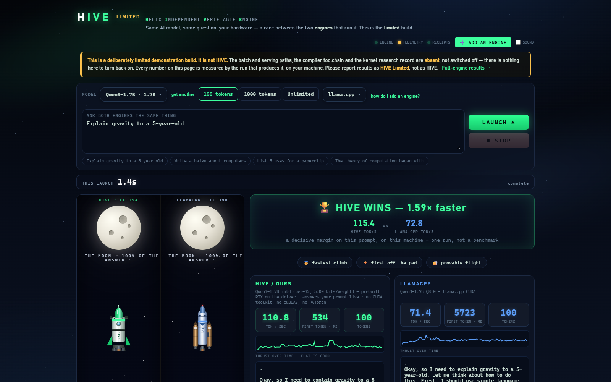
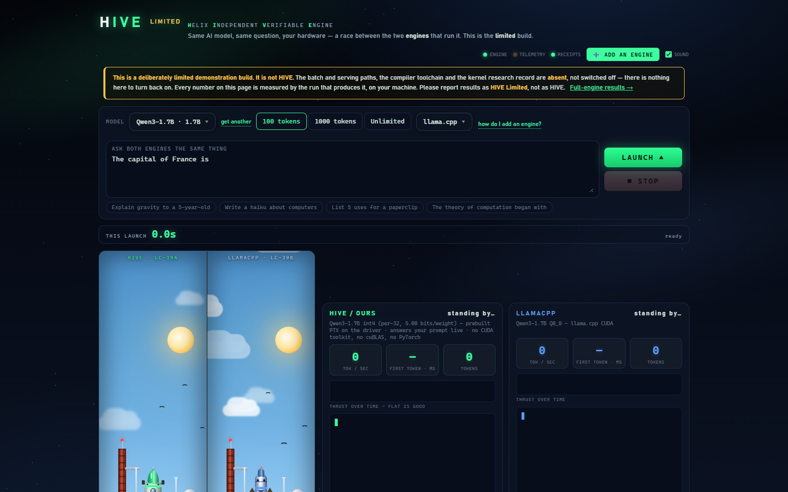

# HIVE Limited — a governed build

> **This is a deliberately limited demonstration build. It is not HIVE.**
>
> This build is named for what it is: deliberately limited. The
> full engine's batch and serving paths, its compiler toolchain, and its kernel
> research record are **not published here**. HIVE Limited is limited by *omission*,
> not by a switch — there is nothing to turn back on.
>
> Please do not present results from this build as HIVE's performance. See
> [LICENSE](LICENSE) §6.

---



## Install it

**Never used a terminal? Start here: [QUICKSTART.md](QUICKSTART.md)** — it assumes no coding,
no GitHub account, and nothing installed.

Otherwise, one line. **Linux / WSL:**

```bash
curl -fsSL https://raw.githubusercontent.com/Questeria/HIVE-Limited/main/install.sh | bash
```

**Windows, native — no WSL needed** (PowerShell):

```powershell
irm https://raw.githubusercontent.com/Questeria/HIVE-Limited/main/install.ps1 | iex
```

Either one checks your machine, fetches the code and a model, and starts the server. If
anything is missing it says exactly what to type. Safe to re-run — finished steps are
skipped, and an interrupted download resumes.

Then open **http://localhost:8080**.

Needs an NVIDIA GPU. Nothing else — not the CUDA toolkit, not PyTorch. (The one Python
package it uses is numpy, which the installer handles.)

---

## What it does

HIVE Limited runs a Qwen3 model on an NVIDIA GPU through a from-scratch inference
stack that depends on **`python3` + `numpy` and the NVIDIA driver (`libcuda`) only** —
no CUDA toolkit, no cuBLAS, no cuDNN, no NCCL, no PyTorch, and no compiler at run time
(kernels ship as prebuilt PTX, loaded through the driver).

Press the receipt button in the arena and it reads this process's own mapped libraries
back to you. It is a check you run, not a claim we make.

It demonstrates three things that are real, measured, and reproducible **by this
repository**:

1. **Single-user decode efficiency.** Batch-1 token generation on the certified
   integer lane.
2. **Bit-exact reproducibility.** The same prompt produces the same tokens, and the
   engine can prove it against an independent reference — an axis no mainstream
   engine offers at all.
3. **Memory efficiency.** 4-bit weights at **5.00 bits per weight** overall — 4 bits of
   body plus a float32 scale for every 32 weights. `bench.sh` computes this from the
   weights it actually loaded; it is not a quoted figure.

   Worth being precise, because a lower number would look better: the full engine has a
   coarser-scaled path that reads fewer bits per weight, and it is **not shipped here**.
   HIVE Limited ships the *finer* per-32 quantization — more bits, and the form the
   bit-exactness work was certified against. Do not compare this 5.00 against a
   competitor's headline 4.x without checking what their scales cost too.

## What it deliberately does not do

| | |
|---|---|
| batch > 1 | not included |
| serving / continuous batching | not included |
| the compiler toolchain | not included — kernels ship as prebuilt PTX |
| kernel research record | not included |
| multi-GPU | not included |
| the current performance frontier | not included |

These are omissions, not restrictions. Modifying this repository will not recover
them.

## Honest numbers

Every figure this **software** prints is measured by the script that prints it, on
your machine, at the moment you run it. No performance number is baked into the
engine, the UI, or the benchmark — a number you cannot reproduce is a claim, not a
demonstration.

```bash
./bench.sh            # runs the benchmark and prints only what it just measured
./verify.sh           # runs the reproducibility check against the reference
```

### The arena — race it against engines you installed

```bash
./setup/download_models.sh                       # Qwen3-1.7B, both formats
./setup/install_llamacpp.sh                      # llama.cpp with CUDA  (or install_vllm.sh)
python3 serve.py ~/.hive-limited/models/Qwen3-1.7B
```

Open <http://127.0.0.1:8080> and press LAUNCH. Both engines answer the same prompt on your
machine and the page shows what it just measured.

With no rival installed it runs **solo** and says so — it does not invent an opponent. The
dropdown marks each engine **not installed** until it is really there, and picking a missing
one tells you how to install it. Already running your own llama.cpp, vLLM, SGLang, TGI or
TensorRT-LLM? Serve it on the port in [docs/ENGINES.md](docs/ENGINES.md) and the arena races
it as-is, with your flags and your build.

Full instructions, including bringing your own model: **[docs/ENGINES.md](docs/ENGINES.md)**.



Comparative results against other engines are **not** shipped as claims by this
build. If you want a comparison, run the other engine yourself on the same machine —
that is the only kind of comparison worth trusting, and it is how every number in the
full engine was established too.

### The one exception, stated plainly

[**REFERENCE.md**](REFERENCE.md) carries dated measurements from the **full engine**,
which is not in this repository. It is there so that this deliberately-slowed build is
not mistaken for the ceiling.

Those figures are **not reproducible here** and are labelled as such. They are a
different kind of statement from everything else in this repo: you are being asked to
take them on our word, dated, with the protocol and the losses disclosed — not shown a
demonstration. Keeping that boundary visible is the point of putting them on their own
page instead of in this one.

## Use the engine in your own program

The engine under the demo is an ordinary Python class: construct it, hand it token ids,
get tokens back — blocking or streamed, locally, through the driver alone.

```bash
python3 examples/ask.py ~/.hive-limited/models/Qwen3-1.7B "Why is the sky blue?"
```

The five-line integration and the full API surface: **[docs/USING_THE_ENGINE.md](docs/USING_THE_ENGINE.md)**.
It stays batch-1 and greedy — what this build ships is what your program gets.

## Requirements

- NVIDIA GPU, compute capability 8.6 or newer
- an NVIDIA driver providing `libcuda`
- `python3` with `numpy`
- Linux, WSL2, or native Windows

Nothing else. The rival engines in `setup/` have their own, much larger requirements —
llama.cpp wants a CUDA toolkit to build, vLLM brings PyTorch. That asymmetry is the point
of the comparison, not an oversight in the instructions.

## Licence

Source-available, **non-commercial**. Free for personal, educational, academic and
other non-commercial use. **Any commercial use requires a separate licence** —
including any use by a for-profit entity, internal or otherwise. See
[LICENSE](LICENSE).

## Preview the unrestricted HIVE

To see the full engine run, discuss commercial licensing, or ask anything about the
measured results in [REFERENCE.md](REFERENCE.md):

📧 **ajdemarco10@gmail.com**

You can also reach the project at [@Questeria](https://github.com/Questeria).
